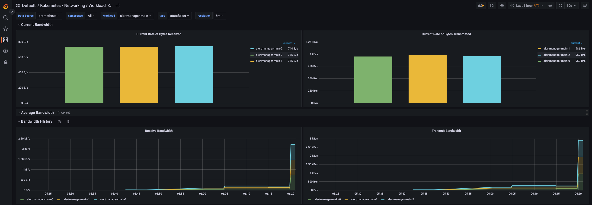

# Install observability stack on kubernetes
navigate to setup
install namespace
- kubectl create -f ./namespace.yaml
  kubectl get namespaces
  kubectl get ns
  kubectl get ns kubedoom
  kubectl describe ns kubedoom
  kubectl get ns kubedoom -o yaml
  cat namespace.yaml
  > differences are runtime info added

## install operator
- kubectl create -f setup
- kubectl get customresourcedefinition.apiextensions.k8s.io
- kubenctl get customresourcedefinition.apiextensions.k8s.io/alertmanagers.monitoring.coreos.com -o yaml
- kubectl describe customresourcedefinition.apiextensions.k8s.io/alertmanagers.monitoring.coreos.com

## install reminder
- kubectl create -f install

## check running pods
- kubectl get pods -n monitoring -w

## check servises
- kubectl get svc -n monitoring

## access grafana 
kubectl --namespace monitoring port-forward svc/grafana 3000
http://localhost:3000
Username: admin
Password: admin (which you have to change on first login please change to admin2)

## access prometheus
kubectl --namespace monitoring port-forward svc/prometheus-k8s 9090
http://localhost:9090

## access alertmanager
kubectl --namespace monitoring port-forward svc/alertmanager-main 9093
http://localhost:9093

## why no data
When you look at the various dashboards you see that there are no data in them.
This is done to a set of network policies that are installed by default into the cluster.
These are useful objects and have a very significant impact on security in real clusters, 
this is however just a workshop and thus we remove them instead of working with them

### check network policies
kubectl get networkpolicies

### get rid of them now
kubectl -n monitoring delete networkpolicies.networking.k8s.io --all

Now there is data in the daskboards.

[Read More](https://computingforgeeks.com/setup-prometheus-and-grafana-on-kubernetes/)
